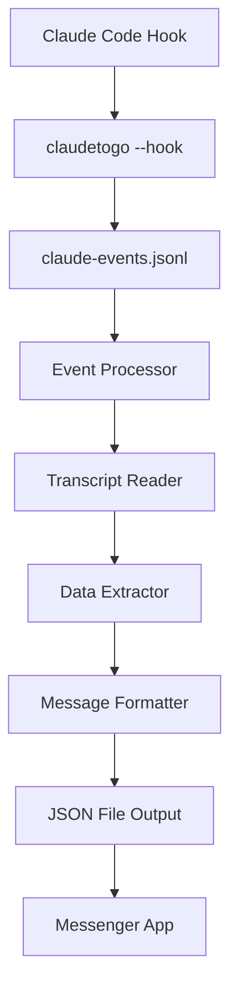

# ClaudeToGo

A Go-based tool for logging, monitoring, and processing Claude Code hook events into messenger-friendly JSON files. ClaudeToGo intercepts Claude Code tool events and transforms them into actionable messages that enable remote interaction via messenger apps.

## 🎯 Purpose

ClaudeToGo bridges the gap between Claude Code and messenger applications by:
- **Monitoring** all Claude Code tool usage events with detailed metadata
- **Processing** events into structured, user-friendly messenger formats
- **Enabling** remote approval/rejection of Claude actions via messenger apps
- **Providing** rich context for informed decision-making about AI assistant actions

## ✨ Features

### Core Capabilities
- **Event Logging**: Captures all Claude Code tool events with detailed metadata
- **Real-time Monitoring**: Live monitoring of events as they occur
- **Interactive Setup**: Guided setup wizard for easy configuration
- **Automatic Hook Configuration**: Seamlessly integrates with Claude Code settings

### ✅ Messenger Integration (Phase 1 & 2 Complete)
- **Smart Event Processing**: Converts raw Claude events into user-friendly messages
- **Tool-Specific Formatting**: Specialized handling for Write, Read, WebFetch, Bash, Edit, List tools
- **Rich Context Extraction**: Provides all necessary information for informed decisions
- **Actionable Suggestions**: Generates approve/reject/review actions with executable commands
- **JSON File Output**: Creates messenger-ready JSON files with emojis and structured data
- **Batch Processing**: Handles multiple events efficiently with error handling

### 🆕 CLI Integration (Phase 2 Complete)
- **Processing Commands**: Complete CLI suite for event processing and statistics
- **Background Service**: Real-time event monitoring with `--service` mode
- **Response Handling**: Interactive approval/rejection of Claude actions
- **Session Management**: Track and query session status and history
- **YAML Configuration**: Comprehensive configuration system with validation
- **Error Recovery**: Robust error handling and graceful shutdown

### System Features
- **Flexible Configuration**: JSON-based configuration with command-line overrides
- **Graceful Shutdown**: Proper signal handling for clean exits
- **Robust Error Handling**: Handles malformed data and missing files gracefully

## 🏗️ Architecture

The project follows Go best practices with a modular architecture:

```
claudetogo/
├── cmd/claudetogo/          # Application entry point
├── internal/
│   ├── types/              # Data structures and models (enhanced with messenger types)
│   ├── logger/             # Structured logging
│   ├── config/             # Configuration management
│   ├── hooks/              # Hook processing logic
│   ├── monitor/            # Event monitoring
│   ├── setup/              # Setup wizard
│   ├── claude/             # Claude Code settings management
│   ├── transcript/         # ✅ Transcript file parsing and processing
│   ├── extractor/          # ✅ Event data extraction engine
│   ├── formatter/          # ✅ Messenger message formatting
│   ├── processor/          # ✅ Complete processing pipeline
│   ├── service/            # 🆕 Background service and file watching
│   ├── responder/          # 🆕 Response handling and session management
│   └── config/             # 🆕 YAML configuration system (enhanced)
├── messenger-output/        # 🆕 Generated JSON files for messenger apps
├── planning/               # 🆕 Documentation and strategy files
├── go.mod                  # Go module definition
└── README.md               # This file
```

### Processing Pipeline



## 🚀 Getting Started

### Prerequisites

- Go 1.22.2 or later
- Claude Code installed and configured

### Installation

1. **Clone the repository:**
   ```bash
   git clone https://github.com/riaanpieterse81/ClaudeToGo.git
   cd ClaudeToGo
   ```

2. **Build the application:**
   ```bash
   go build -o claudetogo ./cmd/claudetogo
   ```

3. **Run the setup wizard (recommended for first-time users):**
   ```bash
   ./claudetogo --setup
   ```

### Quick Start

The setup wizard will guide you through:
- Configuring event log location
- Setting verbosity level  
- Automatically configuring Claude Code hooks
- Displaying usage instructions

## 📖 Usage

### Command Line Options

ClaudeToGo provides a comprehensive CLI with multiple command categories:

#### Basic Commands
```bash
claudetogo --help                           # Show help information
claudetogo --setup                          # Run interactive setup wizard
claudetogo --hook                           # Process hook event from stdin
claudetogo --monitor                        # Monitor events in real-time
claudetogo --config myconfig.json           # Use custom configuration file
```

#### Processing Commands  
```bash
claudetogo --process                        # Process all events
claudetogo --process --latest 5             # Process latest 5 events only
claudetogo --process --generate-samples     # Generate test samples
claudetogo --process --stats                # Show processing statistics
claudetogo --process --watch --interval 5s  # Watch for new events
claudetogo --process --output-dir custom/   # Use custom output directory
```

#### Response Commands
```bash
claudetogo --respond --session ID --action approve   # Approve a pending action
claudetogo --respond --session ID --action reject    # Reject a pending action
claudetogo --status --session ID                     # Get session status
claudetogo --pending                                 # List pending actions
```

#### Service Commands
```bash
claudetogo --service                                 # Run as background service
claudetogo --service --daemon                        # Run as daemon
claudetogo --service --interval 10s                  # Custom service interval
```

#### Configuration Commands
```bash
claudetogo --config-init                             # Create example config file
claudetogo --config-show                             # Show current configuration
claudetogo --config-validate config.yaml            # Validate configuration
claudetogo --messenger-config myconfig.yaml         # Use custom messenger config
```

### Example Workflows

**Initial Setup:**
```bash
# Build and set up ClaudeToGo
go build -o claudetogo ./cmd/claudetogo
./claudetogo --setup                     # Configure Claude Code integration
./claudetogo --config-init               # Create messenger configuration
```

**Processing Events:**
```bash
# Check what events are available
./claudetogo --process --stats           # Show event statistics

# Process events into messenger-friendly JSON
./claudetogo --process                   # Process all events
./claudetogo --process --latest 5        # Process latest 5 events only
./claudetogo --process --generate-samples # Create test samples
```

**Managing Actions:**
```bash
# Check for pending actions
./claudetogo --pending                   # List all pending actions

# Review specific session
./claudetogo --status --session SESSION_ID

# Respond to actions
./claudetogo --respond --session SESSION_ID --action approve
./claudetogo --respond --session SESSION_ID --action reject
```

**Background Processing:**
```bash
# Run continuous monitoring
./claudetogo --service                   # Run in foreground
./claudetogo --service --daemon          # Run in background
./claudetogo --process --watch           # Watch for new events
```

**Configuration Management:**
```bash
./claudetogo --config-show               # View current configuration
./claudetogo --config-validate config.yaml # Validate configuration file
```

**Generated Output:**
- JSON files in `messenger-output/` directory
- Sample files in `messenger-output/test-samples/`
- Response tracking in `messenger-output/responses/`
- Each file contains user-friendly messages with suggested actions

## ⚙️ Configuration

### Configuration System

ClaudeToGo supports two types of configuration:

#### 1. Basic Configuration (JSON)
The setup wizard creates `claudetogo-config.json` for basic settings:

```json
{
  "logFile": "claude-events.jsonl",
  "pollInterval": "100ms",
  "verbose": false
}
```

#### 2. Messenger Configuration (YAML)  
For advanced messenger features, create `claudetogo-messenger.yaml`:

```yaml
# Generate example config with: claudetogo --config-init
messenger:
  output_dir: "messenger-output"     # Directory for JSON files
  file_format: "json"                # Output format: json or jsonl
  include_samples: true              # Generate sample files

processing:
  watch_mode: false                  # Enable automatic file watching
  poll_interval: "2s"                # How often to check for new events
  max_events_per_batch: 10           # Maximum events to process at once

service:
  enabled: false                     # Enable background service mode
  daemon_mode: false                 # Run as daemon process
  log_level: "info"                  # Log level: debug, info, warn, error
  service_interval: "2s"             # Service check interval

formatting:
  include_emojis: true               # Include emojis in messages
  max_message_length: 1000           # Maximum message length
  max_content_preview: 200           # Maximum content preview length

integrations:
  webhook_url: ""                    # HTTP webhook URL for notifications
  slack_token: ""                    # Slack bot token
  telegram_token: ""                 # Telegram bot token
```

**Configuration Commands:**
```bash
./claudetogo --config-init           # Create example messenger config
./claudetogo --config-show           # Show current configuration
./claudetogo --config-validate config.yaml # Validate configuration
```

### Claude Code Integration

The tool integrates with Claude Code through hooks configured in Claude's `settings.json`:

**Configuration Locations:**
- **Global**: `~/.claude/settings.json`
- **Project**: `.claude/settings.json` 
- **Local**: `.claude/settings.local.json`

**Hook Configuration:**
```json
{
  "hooks": {
    "Stop": [
      {
        "matcher": "*",
        "hooks": [
          {
            "type": "command",
            "command": "./claudetogo --hook",
            "timeout": 30
          }
        ]
      }
    ],
    "Notification": [
      {
        "matcher": "*", 
        "hooks": [
          {
            "type": "command",
            "command": "./claudetogo --hook",
            "timeout": 30
          }
        ]
      }
    ]
  }
}
```

## 📊 Event Logging & Processing

### Raw Event Logging

Events are logged in JSON format to `claude-events.jsonl` (or your configured log file):

```json
{
  "session_id": "39b32221-a660-4c59-b515-b4be18909c3c",
  "transcript_path": "/path/to/transcript.jsonl",
  "cwd": "/current/working/directory",
  "hook_event_name": "Notification",
  "tool_name": "Bash",
  "timestamp": "2024-07-29T14:35:49Z",
  "message": "Claude needs your permission to use Bash"
}
```

### 🆕 Processed Messenger Output

**Stop Event (Task Completion):**
```json
{
  "type": "completion",
  "session_id": "1fa8811f-2ec9-48c8-951d-bf524a17f8a9",
  "title": "✅ Task Completed",
  "message": "Created `test.md` in the planning folder with the text \"ABC123\".",
  "actions": [
    {
      "type": "info",
      "label": "ℹ️ View Details",
      "command": "claudetogo status --session 1fa8811f",
      "description": "View full session details",
      "icon": "ℹ️"
    }
  ],
  "context": {
    "cwd": "/home/user/project",
    "task_status": "completed",
    "session_id": "1fa8811f-2ec9-48c8-951d-bf524a17f8a9"
  },
  "timestamp": "2025-07-30T10:35:28.927Z",
  "priority": "medium"
}
```

**Notification Event (Action Required):**
```json
{
  "type": "action_needed",
  "session_id": "1fa8811f-2ec9-48c8-951d-bf524a17f8a9",
  "title": "📝 File Creation Request",
  "message": "Claude wants to create file: test.md\n\nContent preview:\nABC123",
  "actions": [
    {
      "type": "approve",
      "label": "✅ Approve",
      "command": "claudetogo respond --session 1fa8811f --action approve",
      "description": "Allow Claude to create the file",
      "icon": "✅"
    },
    {
      "type": "reject",
      "label": "❌ Reject",
      "command": "claudetogo respond --session 1fa8811f --action reject",
      "description": "Deny the file creation",
      "icon": "❌"
    }
  ],
  "context": {
    "tool_name": "Write",
    "target_file": "/home/user/project/test.md",
    "content_preview": "ABC123",
    "cwd": "/home/user/project"
  },
  "timestamp": "2025-07-30T10:35:21.183Z",
  "priority": "high"
}
```

## 🔧 Development

### Building from Source

```bash
# Build for current platform
go build -o claudetogo ./cmd/claudetogo

# Build for specific platform
GOOS=linux GOARCH=amd64 go build -o claudetogo-linux ./cmd/claudetogo
GOOS=windows GOARCH=amd64 go build -o claudetogo.exe ./cmd/claudetogo
GOOS=darwin GOARCH=amd64 go build -o claudetogo-mac ./cmd/claudetogo
```

### Testing

```bash
# Run tests
go test ./...

# Run tests with coverage
go test -cover ./...
```

### Project Structure

**Core Components:**
- **`cmd/claudetogo/`**: Main application entry point
- **`internal/types/`**: Core data structures and types (enhanced with messenger types)
- **`internal/logger/`**: Structured logging utilities
- **`internal/config/`**: Configuration loading and management
- **`internal/hooks/`**: Hook event processing logic
- **`internal/monitor/`**: Real-time event monitoring
- **`internal/setup/`**: Interactive setup wizard
- **`internal/claude/`**: Claude Code settings management

**✅ Messenger Processing Components (Phase 1):**
- **`internal/transcript/`**: Transcript file parsing and content extraction
- **`internal/extractor/`**: Event data extraction and tool-specific processing
- **`internal/formatter/`**: Messenger message formatting with emojis and actions
- **`internal/processor/`**: Complete processing pipeline from events to JSON files

**🆕 CLI Integration Components (Phase 2):**
- **`internal/service/`**: Background service and file watching capabilities
- **`internal/responder/`**: Response handling and session management
- **`internal/config/`**: Enhanced YAML configuration system

**Output:**
- **`messenger-output/`**: Generated JSON files ready for messenger apps
- **`messenger-output/test-samples/`**: Sample outputs for testing
- **`messenger-output/responses/`**: User response tracking files

## 🤝 Contributing

1. Fork the repository
2. Create a feature branch (`git checkout -b feature/amazing-feature`)
3. Commit your changes (`git commit -m 'Add amazing feature'`)
4. Push to the branch (`git push origin feature/amazing-feature`)
5. Open a Pull Request

## 📄 License

This project is licensed under the MIT License - see the [LICENSE](LICENSE) file for details.

## 🙏 Acknowledgments

- Built for integration with [Claude Code](https://claude.ai/code)
- Follows [Go project layout standards](https://go.dev/doc/modules/layout)

## 📞 Support

If you encounter any issues or have questions:

1. Check the [Issues](https://github.com/riaanpieterse81/ClaudeToGo/issues) page
2. Create a new issue with detailed information
3. Include log files and configuration when reporting bugs

## 🚀 Roadmap

### ✅ Phase 1: Core Data Processing Infrastructure (COMPLETED)
- ✅ Hook event logging and real-time monitoring
- ✅ Automatic Claude Code configuration
- ✅ **Transcript file parsing and processing**
- ✅ **Event data extraction engine**
- ✅ **Messenger message formatting**
- ✅ **JSON file generation for messenger apps**
- ✅ **Tool-specific processing** (Write, Read, WebFetch, Bash, Edit, List)
- ✅ **Comprehensive testing** with real data

### ✅ Phase 2: CLI Integration and Service Mode (COMPLETED)
- ✅ **CLI Command Integration**: Complete `claudetogo --process` command suite
- ✅ **Background Service Mode**: Full file watching with `claudetogo --service`
- ✅ **Response Handling**: Complete `claudetogo --respond` system for user actions
- ✅ **Configuration System**: Full YAML config system with validation
- ✅ **Session Management**: Track and query session status and history
- ✅ **Error Recovery**: Robust error handling and graceful shutdown

### 📋 Phase 3: Advanced Integration (NEXT)
- 📋 **Webhook Integration**: Real-time notifications to external systems
- 📋 **Multi-Platform Support**: Direct Slack, Telegram, etc. integrations
- 📋 **Advanced Deployment**: Enhanced daemon mode and service management
- 📋 **Enhanced Monitoring**: Metrics, health checks, and observability

### 🎯 Current Capabilities

**✅ Production Ready:**
- **Complete CLI Suite**: Process events, manage responses, configure system
- **Background Service**: Continuous event monitoring with `--service` mode
- **Interactive Response System**: Approve/reject Claude actions with full tracking
- **Configuration Management**: YAML configuration with validation and auto-discovery
- **Session Management**: Track session status, history, and user responses
- **Error Handling**: Robust error recovery and comprehensive validation

**✅ Integration Ready:**
- **Messenger JSON Output**: Ready for webhook, Slack, Telegram integration
- **Executable Commands**: All actions include exact commands for user responses
- **Rich Context**: Full session context for informed decision-making
- **Response Tracking**: Complete audit trail of user actions and decisions

**✅ Tested and Verified:**
- All CLI commands tested and working with real data
- Configuration validation with comprehensive error handling
- Response system with session tracking and status management
- Background service with graceful shutdown and error recovery