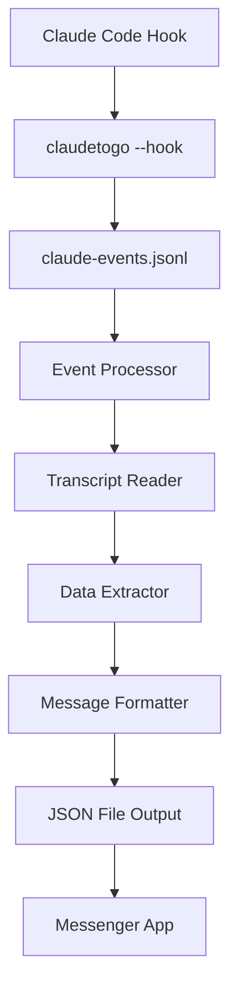

# ClaudeToGo

A Go-based tool for logging, monitoring, and processing Claude Code hook events into messenger-friendly JSON files. ClaudeToGo intercepts Claude Code tool events and transforms them into actionable messages that enable remote interaction via messenger apps.

## 🎯 Purpose

ClaudeToGo bridges the gap between Claude Code and messenger applications by:
- **Monitoring** all Claude Code tool usage events with detailed metadata
- **Processing** events into structured, user-friendly messenger formats
- **Enabling** remote approval/rejection of Claude actions via messenger apps
- **Providing** rich context for informed decision-making about AI assistant actions

## ✨ Features

### Core Capabilities
- **Event Logging**: Captures all Claude Code tool events with detailed metadata
- **Real-time Monitoring**: Live monitoring of events as they occur
- **Interactive Setup**: Guided setup wizard for easy configuration
- **Automatic Hook Configuration**: Seamlessly integrates with Claude Code settings

### 🆕 Messenger Integration (Phase 1 Complete)
- **Smart Event Processing**: Converts raw Claude events into user-friendly messages
- **Tool-Specific Formatting**: Specialized handling for Write, Read, WebFetch, Bash, Edit, List tools
- **Rich Context Extraction**: Provides all necessary information for informed decisions
- **Actionable Suggestions**: Generates approve/reject/review actions with executable commands
- **JSON File Output**: Creates messenger-ready JSON files with emojis and structured data
- **Batch Processing**: Handles multiple events efficiently with error handling

### System Features
- **Flexible Configuration**: JSON-based configuration with command-line overrides
- **Graceful Shutdown**: Proper signal handling for clean exits
- **Robust Error Handling**: Handles malformed data and missing files gracefully

## 🏗️ Architecture

The project follows Go best practices with a modular architecture:

```
claudetogo/
├── cmd/claudetogo/          # Application entry point
├── internal/
│   ├── types/              # Data structures and models (enhanced with messenger types)
│   ├── logger/             # Structured logging
│   ├── config/             # Configuration management
│   ├── hooks/              # Hook processing logic
│   ├── monitor/            # Event monitoring
│   ├── setup/              # Setup wizard
│   ├── claude/             # Claude Code settings management
│   ├── transcript/         # 🆕 Transcript file parsing and processing
│   ├── extractor/          # 🆕 Event data extraction engine
│   ├── formatter/          # 🆕 Messenger message formatting
│   └── processor/          # 🆕 Complete processing pipeline
├── messenger-output/        # 🆕 Generated JSON files for messenger apps
├── planning/               # 🆕 Documentation and strategy files
├── go.mod                  # Go module definition
└── README.md               # This file
```

### Processing Pipeline



## 🚀 Getting Started

### Prerequisites

- Go 1.22.2 or later
- Claude Code installed and configured

### Installation

1. **Clone the repository:**
   ```bash
   git clone https://github.com/riaanpieterse81/ClaudeToGo.git
   cd ClaudeToGo
   ```

2. **Build the application:**
   ```bash
   go build -o claudetogo ./cmd/claudetogo
   ```

3. **Run the setup wizard (recommended for first-time users):**
   ```bash
   ./claudetogo --setup
   ```

### Quick Start

The setup wizard will guide you through:
- Configuring event log location
- Setting verbosity level  
- Automatically configuring Claude Code hooks
- Displaying usage instructions

## 📖 Usage

### Command Line Options

```bash
Usage: claudetogo [options]

Options:
  -config string
        Path to configuration file (JSON format)
  -help
        Show help information
  -hook
        Process hook event from stdin (for Claude Code hooks)
  -logfile string
        Path to log file (default "claude-events.jsonl")
  -monitor
        Monitor events in real-time
  -poll-interval duration
        Polling interval for monitoring (default 100ms)
  -setup
        Run interactive setup wizard
  -verbose
        Enable verbose debug output
```

### Common Commands

**Setup and Configuration:**
```bash
./claudetogo --setup                     # Run setup wizard
./claudetogo --help                      # Show help
```

**Hook Processing (used by Claude Code):**
```bash
./claudetogo --hook                      # Process hook event from stdin
./claudetogo --hook --verbose            # Process with debug output
```

**Monitoring:**
```bash
./claudetogo --monitor                   # Monitor events in real-time
./claudetogo --monitor --verbose         # Monitor with debug output
```

**Custom Configuration:**
```bash
./claudetogo --config myconfig.json      # Use custom config file
./claudetogo --logfile custom.log        # Use custom log file
```

### 🆕 Messenger Processing (Phase 1)

**Process Events into Messenger JSON:**
```bash
# Build the application first
go build -o claudetogo ./cmd/claudetogo

# Process all events from claude-events.jsonl
go run test-phase1.go                    # Run test script to see processing in action

# Or create your own processing script using the processor package
```

**Generated Output:**
- JSON files in `messenger-output/` directory
- Sample files in `messenger-output/test-samples/`
- Each file contains user-friendly messages with suggested actions

## ⚙️ Configuration

### Configuration File

ClaudeToGo uses JSON configuration files. The setup wizard creates `claudetogo-config.json`:

```json
{
  "logFile": "claude-events.jsonl",
  "pollInterval": "100ms",
  "verbose": false
}
```

### Claude Code Integration

The tool integrates with Claude Code through hooks configured in Claude's `settings.json`:

**Configuration Locations:**
- **Global**: `~/.claude/settings.json`
- **Project**: `.claude/settings.json` 
- **Local**: `.claude/settings.local.json`

**Hook Configuration:**
```json
{
  "hooks": {
    "Stop": [
      {
        "matcher": "*",
        "hooks": [
          {
            "type": "command",
            "command": "./claudetogo --hook",
            "timeout": 30
          }
        ]
      }
    ],
    "Notification": [
      {
        "matcher": "*", 
        "hooks": [
          {
            "type": "command",
            "command": "./claudetogo --hook",
            "timeout": 30
          }
        ]
      }
    ]
  }
}
```

## 📊 Event Logging & Processing

### Raw Event Logging

Events are logged in JSON format to `claude-events.jsonl` (or your configured log file):

```json
{
  "session_id": "39b32221-a660-4c59-b515-b4be18909c3c",
  "transcript_path": "/path/to/transcript.jsonl",
  "cwd": "/current/working/directory",
  "hook_event_name": "Notification",
  "tool_name": "Bash",
  "timestamp": "2024-07-29T14:35:49Z",
  "message": "Claude needs your permission to use Bash"
}
```

### 🆕 Processed Messenger Output

**Stop Event (Task Completion):**
```json
{
  "type": "completion",
  "session_id": "1fa8811f-2ec9-48c8-951d-bf524a17f8a9",
  "title": "✅ Task Completed",
  "message": "Created `test.md` in the planning folder with the text \"ABC123\".",
  "actions": [
    {
      "type": "info",
      "label": "ℹ️ View Details",
      "command": "claudetogo status --session 1fa8811f",
      "description": "View full session details",
      "icon": "ℹ️"
    }
  ],
  "context": {
    "cwd": "/home/user/project",
    "task_status": "completed",
    "session_id": "1fa8811f-2ec9-48c8-951d-bf524a17f8a9"
  },
  "timestamp": "2025-07-30T10:35:28.927Z",
  "priority": "medium"
}
```

**Notification Event (Action Required):**
```json
{
  "type": "action_needed",
  "session_id": "1fa8811f-2ec9-48c8-951d-bf524a17f8a9",
  "title": "📝 File Creation Request",
  "message": "Claude wants to create file: test.md\n\nContent preview:\nABC123",
  "actions": [
    {
      "type": "approve",
      "label": "✅ Approve",
      "command": "claudetogo respond --session 1fa8811f --action approve",
      "description": "Allow Claude to create the file",
      "icon": "✅"
    },
    {
      "type": "reject",
      "label": "❌ Reject",
      "command": "claudetogo respond --session 1fa8811f --action reject",
      "description": "Deny the file creation",
      "icon": "❌"
    }
  ],
  "context": {
    "tool_name": "Write",
    "target_file": "/home/user/project/test.md",
    "content_preview": "ABC123",
    "cwd": "/home/user/project"
  },
  "timestamp": "2025-07-30T10:35:21.183Z",
  "priority": "high"
}
```

## 🔧 Development

### Building from Source

```bash
# Build for current platform
go build -o claudetogo ./cmd/claudetogo

# Build for specific platform
GOOS=linux GOARCH=amd64 go build -o claudetogo-linux ./cmd/claudetogo
GOOS=windows GOARCH=amd64 go build -o claudetogo.exe ./cmd/claudetogo
GOOS=darwin GOARCH=amd64 go build -o claudetogo-mac ./cmd/claudetogo
```

### Testing

```bash
# Run tests
go test ./...

# Run tests with coverage
go test -cover ./...
```

### Project Structure

**Core Components:**
- **`cmd/claudetogo/`**: Main application entry point
- **`internal/types/`**: Core data structures and types (enhanced with messenger types)
- **`internal/logger/`**: Structured logging utilities
- **`internal/config/`**: Configuration loading and management
- **`internal/hooks/`**: Hook event processing logic
- **`internal/monitor/`**: Real-time event monitoring
- **`internal/setup/`**: Interactive setup wizard
- **`internal/claude/`**: Claude Code settings management

**🆕 Messenger Processing Components:**
- **`internal/transcript/`**: Transcript file parsing and content extraction
- **`internal/extractor/`**: Event data extraction and tool-specific processing
- **`internal/formatter/`**: Messenger message formatting with emojis and actions
- **`internal/processor/`**: Complete processing pipeline from events to JSON files

**Output:**
- **`messenger-output/`**: Generated JSON files ready for messenger apps
- **`messenger-output/test-samples/`**: Sample outputs for testing

## 🤝 Contributing

1. Fork the repository
2. Create a feature branch (`git checkout -b feature/amazing-feature`)
3. Commit your changes (`git commit -m 'Add amazing feature'`)
4. Push to the branch (`git push origin feature/amazing-feature`)
5. Open a Pull Request

## 📄 License

This project is licensed under the MIT License - see the [LICENSE](LICENSE) file for details.

## 🙏 Acknowledgments

- Built for integration with [Claude Code](https://claude.ai/code)
- Follows [Go project layout standards](https://go.dev/doc/modules/layout)

## 📞 Support

If you encounter any issues or have questions:

1. Check the [Issues](https://github.com/riaanpieterse81/ClaudeToGo/issues) page
2. Create a new issue with detailed information
3. Include log files and configuration when reporting bugs

## 🚀 Roadmap

### ✅ Phase 1: Core Data Processing Infrastructure (COMPLETED)
- ✅ Hook event logging and real-time monitoring
- ✅ Automatic Claude Code configuration
- ✅ **Transcript file parsing and processing**
- ✅ **Event data extraction engine**
- ✅ **Messenger message formatting**
- ✅ **JSON file generation for messenger apps**
- ✅ **Tool-specific processing** (Write, Read, WebFetch, Bash, Edit, List)
- ✅ **Comprehensive testing** with real data (18 events processed)

### 🔄 Phase 2: CLI Integration and Service Mode (NEXT)
- 🔄 **CLI Command Integration**: Add `claudetogo process` commands
- 🔄 **Background Service Mode**: File watching and continuous processing
- 🔄 **Response Handling**: `claudetogo respond` for user actions
- 🔄 **Configuration System**: YAML config for deployment options

### 📋 Phase 3: Advanced Integration (FUTURE)
- 📋 **Webhook Integration**: Real-time notifications to external systems
- 📋 **Multi-Platform Support**: Slack, Telegram, etc. integrations
- 📋 **Advanced Deployment**: Daemon mode and service management
- 📋 **Enhanced Monitoring**: Metrics and health checks

### 🎯 Current Capabilities

**Ready for Use:**
- Process existing events into messenger JSON: `go run test-phase1.go`
- Generate sample outputs in `messenger-output/test-samples/`
- Handle both completion notifications and action requests
- Provide rich context and suggested actions for each event type

**Integration Ready:**
- JSON files contain all necessary data for messenger app integration
- Suggested actions include executable commands for user responses
- Rich context provides full information for informed decision-making